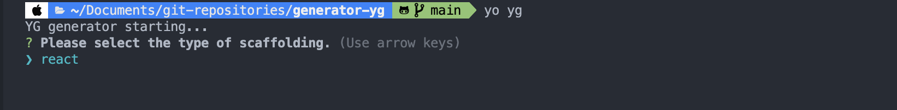

# generator-yg

This is a personal generator. You can use it freely if necessary. Bug PR is very welcome. (Please feel free to fill out the issue PR.)

## Gettting started

### 1. Install

```bash
$ npm install -g yo
$ npm install -g generator-yg
```

### 2. Use scaffolding

```bash
$ yo yg
```



### 3. Specs

<details><summary>react</summary>

    - react
    - emotion/styled
    - typescript
    - eslint
    - prettier
    - husky
    - commit-lint
    - lint-staged
    - jest

</details>
